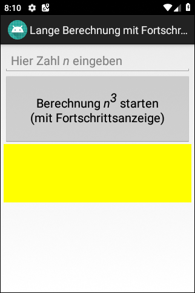
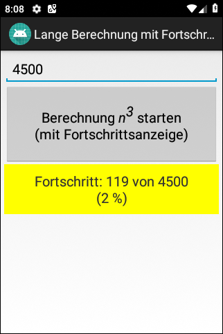

# Android-App "Lange Berechnung mit Fortschrittsanzeige"

Android app demonstrates how to display progress when a long running calculation is performed in a background 
thread using class [AsyncTask](https://developer.android.com/reference/android/os/AsyncTask).

 

This app is a variation of the app [Langlaufende Operationen](https://github.com/MDecker-MobileComputing/Android_LanglaufendeOperationen).

 

Identifiers (names for classes, variables and methods), (JavaDoc) comments and UI texts are in German only.

 

----
## Screenshots

  

 

 

 

----
# License

See the [LICENSE file](LICENSE.md) for license rights and limitations (BSD 3-Clause License).
